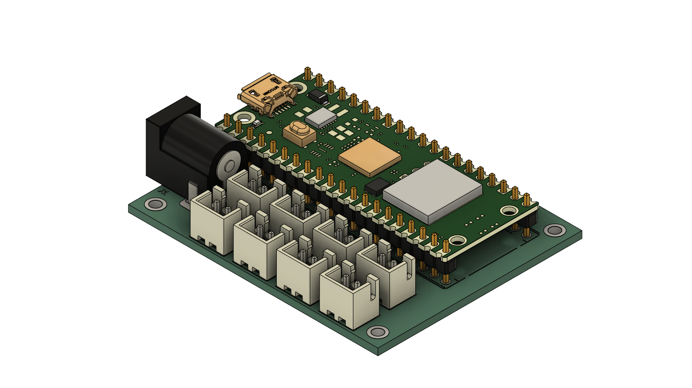

# 💡 Schrankbeleuchtung

Automatisierte LED-Beleuchtung für Schränke, basierend auf einem Raspberry Pi Pico W. Türsensoren aktivieren bei Öffnung die zugeordneten LED-Gruppen über MOSFET-Schaltungen.

---

## 🧩 Features

- Bis zu 4 separat schaltbare LED-Gruppen
- Automatische Steuerung über Magnetsensoren oder Reed-Schalter
- Versorgung mit 12 V DC, intern auf 5 V und 3.3 V geregelt
- Geringe Standby-Leistung durch Low-RDS(on)-MOSFETs
- Erweiterbare Anschlüsse über XH-Steckerleisten

---

## 🔌 GPIO-Belegung (Pico W)

| Funktion         | GPIO     |
|------------------|----------|
| LED 1 (Q1)       | GPIO02   |
| LED 2 (Q2)       | GPIO04   |
| LED 3 (Q3)       | GPIO05   |
| LED 4 (Q4)       | GPIO06   |
| Sensor 1         | GPIO06   |
| Sensor 2         | GPIO07   |
| Sensor 3         | GPIO14   |
| Sensor 4         | GPIO15   |

---

## 🛠 Komponenten (Auszug)

| Bauteil      | Typ / Wert              | Bestellnummer (Mouser)  |
|--------------|-------------------------|--------------------------|
| A1           | Raspberry Pi Pico W     | 358-SC0918               |
| U1           | TPS560430XDBVT          | 595-TPS560430XDBVT       |
| Q1–Q4        | IRLML0030TRPBF          | 942-IRLML0030TRPBF       |
| R1–R4        | 187 Ω Widerstände       | 667-ERA-6AEB1870V        |
| R5–R9        | 10 kΩ Pull-Ups          | 667-ERA-6APB103V         |
| C1–C3        | 10 µF / 22 µF / 0.1 µF  | siehe BOM                |
| L1           | 10 µH Spule             | 81-LQH44PN100MPRL        |
| J2–J9        | XH-Stecker + Buchsen    | 306-B2B-XH-AMLFSNP       |

Die vollständige Stückliste befindet sich in [Schrankbeleuchtung.xlsx](Schrankbeleuchtung.xlsx)

---

## ⚙️ Inbetriebnahme

1. Platine bestücken (nach Schaltplan aus *Schrankbeleuchtung.pdf*)
2. 12 V Versorgung an J1 anschließen
3. Türsensoren an J2–J5, LEDs an J6–J9 verbinden
4. Firmware auf Pico W flashen (z. B. mit MicroPython)
5. Funktion testen – bei Türöffnung sollten zugehörige LEDs leuchten

---

## 🧠 Firmware-Hinweise

Die Firmware sollte:

- LED-GPIOs als Output setzen
- Sensor-GPIOs mit Pull-Up und Debounce abfragen
- Bei erkanntem Öffnungssignal LEDs aktivieren
- Optional: MQTT-/WLAN-Anbindung via Pico W realisieren

---

## ⚖️ Lizenz

Dieses Projekt steht unter der MIT-Lizenz. Feel free to modify, use & share!
